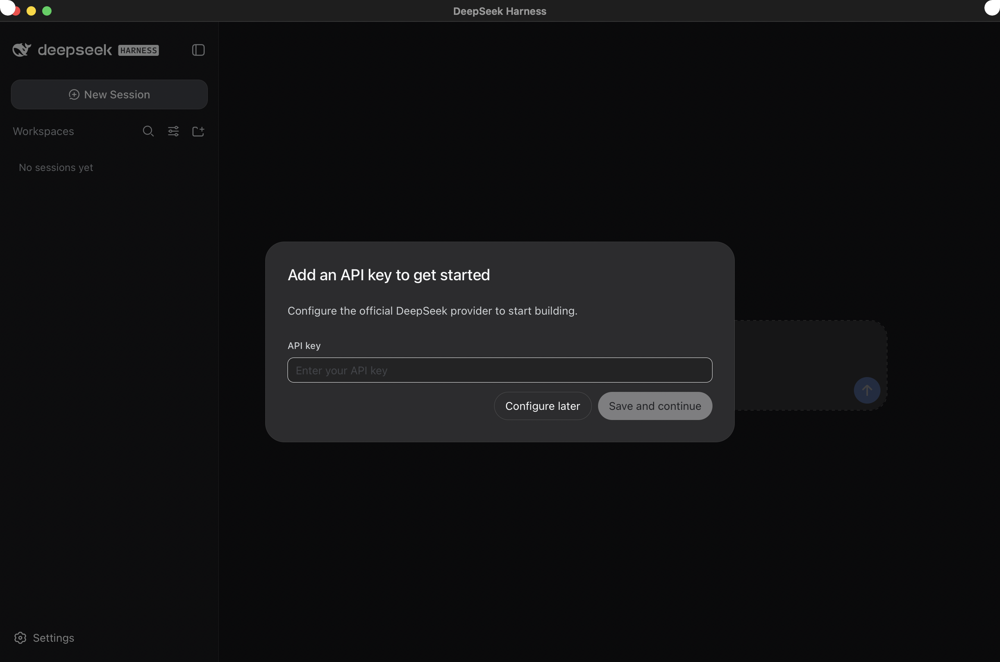
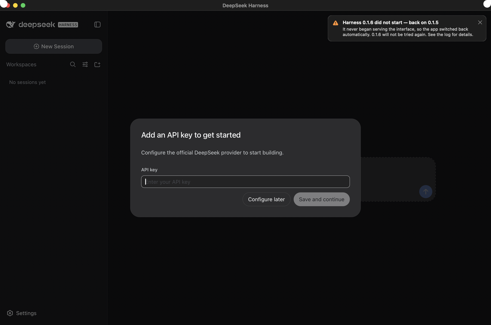

# dsh-mac

A native macOS app for [DeepSeek Harness](https://github.com/deepseek-ai/deepseek-harness). It runs the real DSH web UI in its own window, so your agent does not share a browser profile, session, or keyboard shortcuts with your personal browsing.

It starts `dsh web`, waits for it to listen, shows the GUI in a `WKWebView`, and stops the server when you quit.



## Install

One command. It downloads the latest release, checks its checksum and signature, puts the app in `/Applications`, trusts it, and opens it:

```sh
curl -fsSL https://raw.githubusercontent.com/barisuraz/dsh-mac/main/install.sh | sh
```

Or do it by hand: open the `dsh-mac-<version>.dmg` from **[Releases](https://github.com/barisuraz/dsh-mac/releases)** and drag the app to Applications, then clear the quarantine flag yourself:

```sh
xattr -dr com.apple.quarantine "/Applications/DeepSeek Harness.app"
```

That flag is needed because the build is ad-hoc signed rather than notarized, which requires a paid Apple Developer account. Building from source avoids it entirely.

`install.sh` reads three optional variables: `DSH_INSTALL_DIR`, `DSH_VERSION` (a tag such as `v1.2`), and `DSH_NO_OPEN`.

## Requirements

- macOS 13 or later
- Node and npm, to fetch the harness

There is no need to install DSH first; see [First run](#first-run).

## Or build from source

Needs the Xcode Command Line Tools (`xcode-select --install`).

```sh
git clone https://github.com/barisuraz/dsh-mac
cd dsh-mac
./build.sh
cp -R "build/DeepSeek Harness.app" /Applications/
```

`build.sh` downloads nothing and takes a few seconds.

## What it is

One Swift file. It is a shell, not a fork: no harness logic, no reimplemented UI, no DSH config, API, or plugin interface. Everything in the window is upstream DSH, so new harness features appear as soon as they ship.

It is not a chat client. It calls no model API, stores no conversations, and manages no credentials.

## Updates

DSH is in developer preview and changes constantly, so the app updates it on every launch, the way Android does A/B system updates. Two copies are kept and an update only ever lands in the idle one:

```
slot a ── running now          new versions install into the idle slot,
slot b ── known-good fallback   never over the copy you are using
```

1. The preferred slot boots and shows your GUI. No download is awaited.
2. Once the running version has stayed up for a minute, the newest release is installed into the other slot.
3. That copy starts on a throwaway port and must serve the UI before it is trusted.
4. Next launch it becomes your version and the one it replaced stays as the fallback.

If a new version is bad, the app recovers on its own and says so:

- **It will not start.** Caught before it ever becomes your running version, and discarded.
- **It starts then keeps dying.** Three early exits and the app stops retrying, marks it broken, and switches back.

Either way a card names the version that failed, the version you are on now, and why. Warnings stay until dismissed; progress notices fade.

 A version that failed to start is not downloaded again — `⌘U` clears that and retries, and `Reinstall Harness…` rebuilds the idle slot.

Both copies take roughly 600 MB, plus an npm cache the app keeps to itself under `~/Library/Application Support/DeepSeekHarness`. Your own npm cache is untouched.

### First run

You never have to install DSH yourself. If no harness exists, the first launch installs one and serves it. If you already have one, that copy is used immediately — the first launch is as fast as you are used to — and a managed slot is provisioned in the background. Either way your existing setup is left as it was.

## Behaviour

**Your existing harness is left alone.** If port `3080` is taken, the app asks the OS for a free port instead of fighting over it.

**Nothing outlives the app.** The server runs under a supervisor that shuts it down even if the app is force-killed, so no orphaned `node` process holds a port.

**Sessions carry over.** The app uses the same `~/.dsh` as the command line, so existing sessions, workspaces, and credentials appear with no migration.

**Storage is its own.** The webview uses the app's own container, so cookies and local storage never mix with Chrome or Safari.

## Configuration

All optional, read from the environment, so launch from a terminal to use them.

| Variable | Default | Meaning |
| --- | --- | --- |
| `DSH_WRAPPER_PORT` | `3080` | Port to prefer; falls back to an OS-assigned port if busy. |
| `DSH_MANAGED` | `1` | Set to `0` to skip slots and updates and use whatever `dsh` resolves to. |
| `DSH_NO_AUTO_UPDATE` | `0` | Set to `1` to keep slots but never fetch on launch. |
| `DSH_NO_SYSTEM_DSH` | `0` | Set to `1` to ignore any harness on `PATH` and use only managed slots. |
| `DSH_SLOT_VERSION` | newest | Pin slots to a version instead of tracking the newest. |
| `DSH_BIN` | auto-detected | Explicit path to a `dsh` executable. |
| `DSH_APP_SUPPORT` | `~/Library/Application Support/DeepSeekHarness` | Where slots and update state live. |
| `DSH_WRAPPER_LOG` | `~/Library/Logs/DeepSeekHarness/wrapper.log` | Where to write diagnostics. |

`DSH_HOME` and the rest of your DSH environment are inherited unchanged.

## Keyboard

| Shortcut | Action |
| --- | --- |
| `⌘R` | Reload the GUI |
| `⇧⌘R` | Restart the harness |
| `⌘U` | Check for Harness updates |
| `⌘+` / `⌘-` / `⌘0` | Zoom |
| `⌘Q` | Quit and stop the harness |

## Maintenance

The risk with any wrapper is that upstream moves and the wrapper rots, so this one stays coupled to a single contract:

> 1. a `dsh` executable can be resolved,
> 2. `dsh web --no-open --port N` serves the GUI on loopback,
> 3. it prints a loopback URL carrying a `token` parameter.

Claim 3 is a log line rather than a documented interface, so `--test-parser` and `--check-contract` fail loudly when it drifts. CI runs both on every push and weekly, turning upstream changes into a red build naming the broken claim instead of a window that never loads.

### Diagnostics

```sh
APP="/Applications/DeepSeek Harness.app/Contents/MacOS/DeepSeekHarness"

"$APP" --selftest          # what it resolved
"$APP" --test-parser       # readiness-line parser, including refusals
"$APP" --test-update       # A/B slots and crash-loop detection
"$APP" --test-notice       # notice card rendering
"$APP" --install-harness   # fetch a harness into a slot, headless
"$APP" --check-contract    # start a real harness and verify the contract
"$APP" --screenshot out.png --notice rollback   # render the window to a PNG

./tools/test-ab.sh         # recovery, against deliberately broken harnesses
```

## Security

The harness runs local code execution behind a loopback URL, and the app respects that boundary:

- Only `http` URLs on `127.0.0.1` or `localhost` carrying a `token` are ever loaded, and the parser is tested against non-loopback input.
- The token is read from the harness's output, used once, and redacted from all diagnostics.
- DSH refuses to bind `0.0.0.0`, and this app does not change that.
- Links to other sites open in your default browser, not in the harness window.
- Installs run `npm install` with the app's own cache. Nothing is installed globally and no shell profile is modified.
- DSH is in developer preview. Review anything you run against your own machine.

## Project layout

```
Sources/main.swift          the entire app: window, launcher, supervisor, slots, diagnostics
install.sh                  the download-and-install one-liner
build.sh                    compiles, assembles, icons, and signs the bundle
tools/package.sh            builds a release disk image and verifies it by mounting it
tools/make-dmg.sh           the disk image itself
tools/notarize.sh           sign, notarize, and staple a release build
tools/test-ab.sh            end-to-end update and recovery tests
tools/make-icon.swift       the icon, drawn as vectors at each required size
docs/                       screenshots, rendered by the app itself
```

## Publishing a release

Builds are ad-hoc signed by default, which is all a local copy needs. A release other people can open without the quarantine step must be signed with a **Developer ID Application** certificate and notarized by Apple, which requires a paid Apple Developer account.

`build.sh` always enables the hardened runtime, so what you test locally is what gets notarized:

```sh
xcrun notarytool store-credentials "dsh-mac" \
  --apple-id "you@example.com" --team-id "YOURTEAMID" --password "app-specific-password"

DSH_SIGN_IDENTITY="Developer ID Application: Your Name (YOURTEAMID)" ./tools/notarize.sh
```

The script builds, refuses to continue if the signature is not Developer ID, not hardened, or not timestamped, then notarizes and staples **both** the app and the disk image, confirming Gatekeeper accepts each. It leaves `build/dsh-mac-<version>.dmg` ready to upload. Setup details are in the header of [tools/notarize.sh](tools/notarize.sh).

Submitting the image alone would notarize the app inside it, but only the image would carry a staple, and `install.sh` copies the app out into `/Applications` where it is then assessed on its own. Both are notarized so each artifact is self-sufficient.

The app needs no entitlement exceptions: hardened runtime restrictions are per-binary, and it spawns `node` and `zsh` as separate processes.

## License

MIT, see [LICENSE](LICENSE).

The app icon uses the DeepSeek whale mark, parsed from the vector asset DSH ships in its web frontend. The mark belongs to DeepSeek and is used only to identify what the app runs; replace it if you redistribute this under another name. Not affiliated with or endorsed by DeepSeek.
